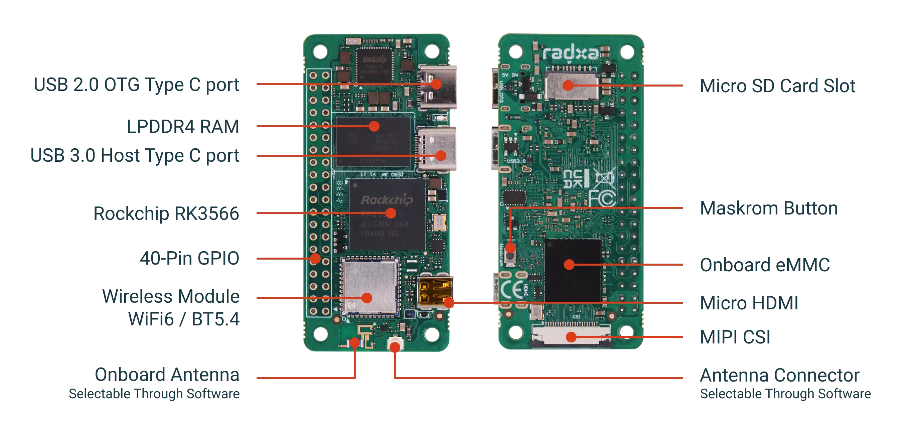
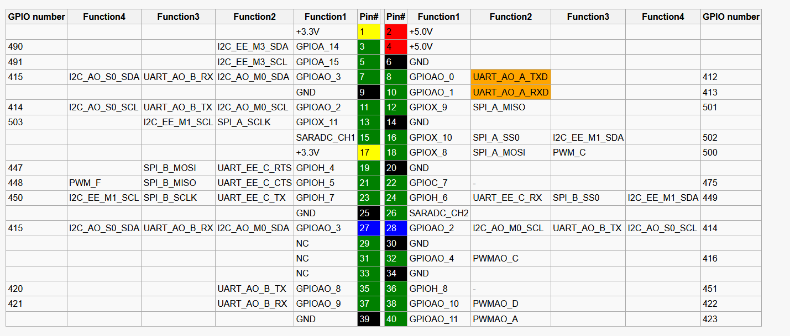

# Pinout Diagram

The Radxa Zero 3W features a 40-pin GPIO header compatible with the Raspberry Pi, enabling a wide range of hardware projects and HATs.

---

## Board Hardware Overview

---

## Pinout Overview

Below is the standard 40-pin GPIO layout for the Radxa Zero 3W:

> **Note:** If you do not see the images, ensure they exist in your `docs/img/` directory.

---

## Pin Functions Table

| Pin | Name   | Function         | Pin | Name   | Function         |
|-----|--------|------------------|-----|--------|------------------|
| 1   | 3.3V   | Power            | 2   | 5V     | Power            |
| 3   | GPIO2  | SDA1 (I2C)       | 4   | 5V     | Power            |
| 5   | GPIO3  | SCL1 (I2C)       | 6   | GND    | Ground           |
| 7   | GPIO4  | GPIO             | 8   | GPIO14 | UART TXD         |
| 9   | GND    | Ground           | 10  | GPIO15 | UART RXD         |
| 11  | GPIO17 | GPIO             | 12  | GPIO18 | PWM              |
| 13  | GPIO27 | GPIO             | 14  | GND    | Ground           |
| 15  | GPIO22 | GPIO             | 16  | GPIO23 | GPIO             |
| 17  | 3.3V   | Power            | 18  | GPIO24 | GPIO             |
| 19  | GPIO10 | SPI MOSI         | 20  | GND    | Ground           |
| 21  | GPIO9  | SPI MISO         | 22  | GPIO25 | GPIO             |
| 23  | GPIO11 | SPI SCLK         | 24  | GPIO8  | SPI CE0          |
| 25  | GND    | Ground           | 26  | GPIO7  | SPI CE1          |
| 27  | GPIO0  | ID_SD            | 28  | GPIO1  | ID_SC            |
| 29  | GPIO5  | GPIO             | 30  | GND    | Ground           |
| 31  | GPIO6  | GPIO             | 32  | GPIO12 | PWM              |
| 33  | GPIO13 | PWM              | 34  | GND    | Ground           |
| 35  | GPIO19 | SPI MISO         | 36  | GPIO16 | GPIO             |
| 37  | GPIO26 | GPIO             | 38  | GPIO20 | GPIO             |
| 39  | GND    | Ground           | 40  | GPIO21 | GPIO             |

---

## 🛠️ Common Uses & Practical Examples

The GPIO header on the Radxa Zero 3W opens up a world of hardware possibilities. Here are some of the most common and practical uses for these pins:

- **Digital I/O:**  
  - Control LEDs, relays, or buzzers (output)
  - Read buttons, switches, or motion sensors (input)
  - Example: Blink an LED or detect a button press using Python and `libgpiod`

- **I2C (Inter-Integrated Circuit):**  
  - Connect multiple sensors (temperature, humidity, accelerometers)
  - Interface with real-time clocks (RTC), OLED/LCD displays, or GPIO expanders
  - Example: Use a 16x2 I2C LCD to display system status

- **SPI (Serial Peripheral Interface):**  
  - High-speed communication with displays (TFT, OLED), ADC/DAC chips, or SD card modules
  - Example: Read analog sensors using an SPI ADC chip

- **UART (Serial Communication):**  
  - Debug the board via serial console
  - Connect to GPS modules, Bluetooth modules, or other microcontrollers
  - Example: Use a USB-to-serial adapter for headless setup or troubleshooting

- **PWM (Pulse Width Modulation):**  
  - Control servo motors, dim LEDs, or generate audio tones
  - Example: Build a simple robot or LED dimmer

---

### 🧑‍🔬 Example Projects

- **Blink an LED:**  
  Use a GPIO pin as output to turn an LED on and off at regular intervals.

- **Button Input:**  
  Detect when a button is pressed and trigger an action (e.g., toggle an LED).

- **I2C Sensor Readout:**  
  Connect a temperature sensor (like BME280) via I2C and display readings.

- **SPI Display:**  
  Show graphics or text on an SPI-connected OLED or TFT display.

- **Serial Console:**  
  Access the board’s terminal over UART for headless operation.

- **PWM Servo Control:**  
  Move a servo motor to different angles using PWM signals.

---

### ⚡ Tips for Safe and Effective GPIO Use

- **Voltage:** All GPIOs use 3.3V logic. **Never connect 5V signals directly** to GPIO pins.
- **Current:** Each GPIO pin can source/sink only a limited amount of current (typically <10mA). Use transistors or relays for high-power loads.
- **Pinout Reference:** Always double-check the pinout before connecting hardware to avoid damage.
- **Libraries:** Use `python3-libgpiod` for GPIO access in Python. For I2C/SPI, use `smbus2` or `spidev` libraries.

---

## 🔗 Additional Resources

- [Official Radxa Zero 3W Documentation](https://docs.radxa.com/en/zero/zero3)
- [Pinout Diagram (PDF)](https://wiki.radxa.com/Zero3/hw)
- [GPIO Projects Tutorial](tutorial-gpio.md)
- [Raspberry Pi Pinout Reference (compatible layout)](https://pinout.xyz/)

!!! warning "Voltage Warning"
    All GPIOs use 3.3V logic. **Do not connect 5V signals directly to GPIO pins.**