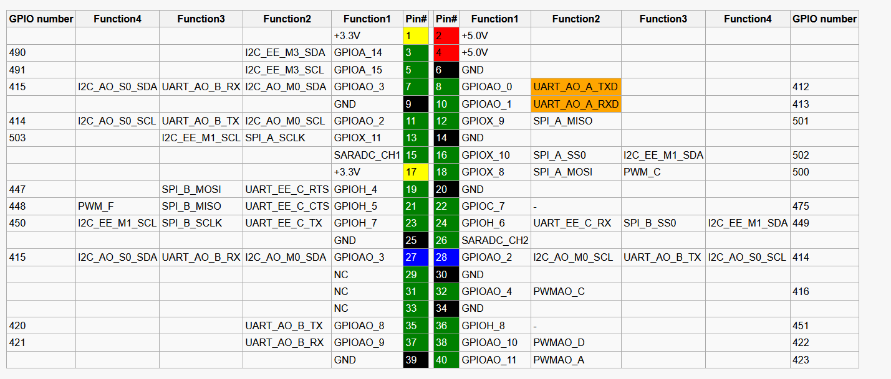

# 🔹 Pinout Diagram

The Radxa Zero 3W features a 40-pin GPIO header compatible with the Raspberry Pi, enabling a wide range of hardware projects and HATs.

---

##  Pinout Overview

Below is the standard 40-pin GPIO layout for the Radxa Zero 3W:

> **Note:** If you do not see the images, ensure they exist in your `docs/img/` directory.

---

## 📊 Pin Functions Table

| Pin | Name   | Function   | Pin | Name   | Function |
| --- | ------ | ---------- | --- | ------ | -------- |
| 1   | 3.3V   | Power      | 2   | 5V     | Power    |
| 3   | GPIO2  | SDA1 (I2C) | 4   | 5V     | Power    |
| 5   | GPIO3  | SCL1 (I2C) | 6   | GND    | Ground   |
| 7   | GPIO4  | GPIO       | 8   | GPIO14 | UART TXD |
| 9   | GND    | Ground     | 10  | GPIO15 | UART RXD |
| 11  | GPIO17 | GPIO       | 12  | GPIO18 | PWM      |
| 13  | GPIO27 | GPIO       | 14  | GND    | Ground   |
| 15  | GPIO22 | GPIO       | 16  | GPIO23 | GPIO     |
| 17  | 3.3V   | Power      | 18  | GPIO24 | GPIO     |
| 19  | GPIO10 | SPI MOSI   | 20  | GND    | Ground   |
| 21  | GPIO9  | SPI MISO   | 22  | GPIO25 | GPIO     |
| 23  | GPIO11 | SPI SCLK   | 24  | GPIO8  | SPI CE0  |
| 25  | GND    | Ground     | 26  | GPIO7  | SPI CE1  |
| 27  | GPIO0  | ID\_SD     | 28  | GPIO1  | ID\_SC   |
| 29  | GPIO5  | GPIO       | 30  | GND    | Ground   |
| 31  | GPIO6  | GPIO       | 32  | GPIO12 | PWM      |
| 33  | GPIO13 | PWM        | 34  | GND    | Ground   |
| 35  | GPIO19 | SPI MISO   | 36  | GPIO16 | GPIO     |
| 37  | GPIO26 | GPIO       | 38  | GPIO20 | GPIO     |
| 39  | GND    | Ground     | 40  | GPIO21 | GPIO     |

---

## 🔧 Common Uses & Examples

The GPIO header allows many hardware interfaces:

* **Digital I/O:** Blink LEDs, read switches and buttons
* **I2C:** Connect sensors, OLED displays, RTCs
* **SPI:** High-speed interfaces with ADCs, displays, flash memory
* **UART:** Serial console or communication with GPS/Bluetooth
* **PWM:** Servo control, dimming LEDs, tone generation

---

## 🧑‍🔬 Example Projects

* Blink an LED using GPIO output
* Read a button using GPIO input
* Display temperature using I2C sensor
* Drive an SPI OLED display
* UART console via FTDI for debugging
* PWM servo control with Python

---

## ⚡ Safe GPIO Usage Tips

* GPIO logic level: **3.3V** — Do **not** connect 5V directly
* Limit GPIO current draw (<10mA per pin)
* Double-check wiring against pinout
* Recommended libraries: `libgpiod`, `python3-libgpiod`, `smbus2`, `spidev`

---

## 🔗 Additional Resources

* [Example Programs](tutorial-gpio.md)
* [Raspberry Pi Pinout (compatible)](https://pinout.xyz/)
* [Datasheets & Schematics](resources-datasheets.md)

!!! warning "Voltage Warning"
    All GPIOs use 3.3V logic. **Never connect 5V signals directly to GPIO pins.**
