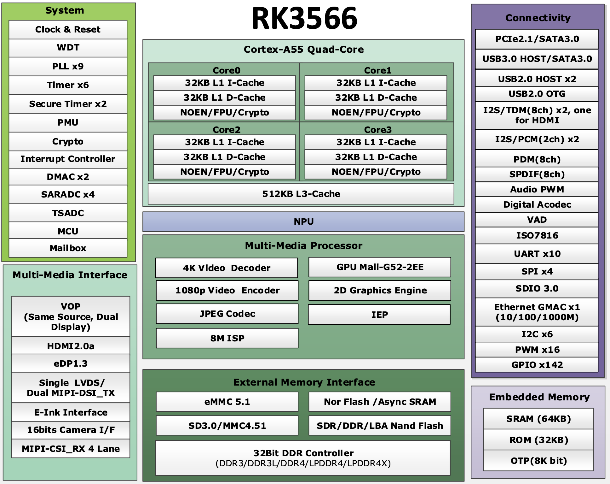

# 📊 Hardware Specifications

This page details the technical specifications of the Radxa Zero 3W single-board computer.

---

## Core Specifications

| Feature         | Specification                                  |
|-----------------|------------------------------------------------|
| **CPU**         | Quad-core ARM Cortex-A53 @ 1.8GHz              |
| **GPU**         | Mali-G31 MP2                                   |
| **RAM**         | 1GB / 2GB / 4GB / 8GB LPDDR4                   |
| **Storage**     | microSD card slot, eMMC module (8/16/32/64GB)  |
| **Wireless**    | Wi-Fi 5 (802.11ac), Bluetooth 5.0              |
| **Video Output**| HDMI 2.0 (up to 4K@60Hz)                       |
| **Audio**       | HDMI audio, I2S, onboard microphone            |
| **USB**         | 1x USB 3.0 OTG, 1x USB 2.0                     |
| **GPIO**        | 40-pin header (Raspberry Pi compatible)        |
| **IR Receiver** | Yes                                            |
| **Power**       | USB-C (5V/2A recommended)                      |
| **Dimensions**  | 65mm x 30mm                                    |

---

## GPIO Header

- 40-pin, 3.3V logic, supports I2C, SPI, UART, PWM, and GPIO
- Compatible with most Raspberry Pi HATs and accessories
- For pinout details, see the [Pinout Diagram](hardware-pinout.md)

---

## Block Diagram

---

## References

- [Official Radxa Zero 3W Documentation](https://docs.radxa.com/en/zero/zero3)
- [Datasheets and Schematics](resources-datasheets.md)

**✨ Feature Highlight:**  
Radxa Zero 3W supports both eMMC and microSD for flexible storage options!

