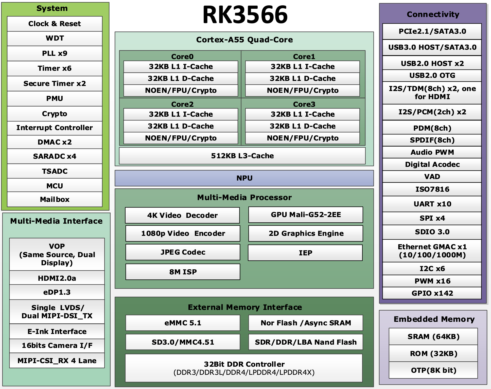

# 📊 Hardware Specifications

This page details the technical specifications of the Radxa Zero 3W single-board computer.

---

## 🚀 Core Specifications

| Feature          | Specification                                    |
| ---------------- | ------------------------------------------------ |
| **CPU**          | Quad-core ARM Cortex-A53 @ 1.8GHz                |
| **GPU**          | Mali-G31 MP2                                     |
| **RAM**          | 1GB / 2GB / 4GB / 8GB LPDDR4                     |
| **Storage**      | microSD card slot, optional eMMC module (8–64GB) |
| **Wireless**     | Wi-Fi 5 (802.11ac), Bluetooth 5.0                |
| **Video Output** | HDMI 2.0 (up to 4K\@60Hz)                        |
| **Audio**        | HDMI audio, I2S, onboard microphone              |
| **USB**          | 1x USB 3.0 OTG, 1x USB 2.0                       |
| **GPIO**         | 40-pin header (Raspberry Pi compatible)          |
| **IR Receiver**  | Yes                                              |
| **Power**        | USB-C (5V/2A recommended)                        |
| **Dimensions**   | 65mm x 30mm                                      |

---

## 🛠️ GPIO Header

* 40-pin, 3.3V logic-level compatible
* Supports I2C, SPI, UART, PWM, GPIO
* Compatible with Raspberry Pi HATs and peripherals

> See [Pinout Diagram](hardware-pinout.md) for detailed GPIO mapping

---

## 📊 Block Diagram

---

## 🔗 References

* [Hardware Datasheets & Schematics](resources-datasheets.md)
* [Radxa Documentation Archive](https://dl.radxa.com/zero3/docs/hw/3w/)

!!! tip "✨ Feature Highlight"
    Radxa Zero 3W supports both eMMC and microSD for flexible storage options!
