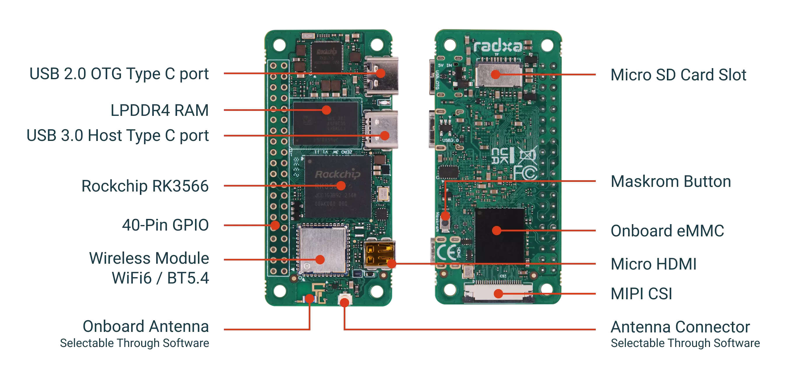

# 🖥️ Hardware Overview

The Radxa Zero 3W is a compact, high-performance single-board computer (SBC) designed for modern embedded systems and maker projects.

---

## 🖌️ Board Layout

The board features a quad-core ARM Cortex-A55 processor, LPDDR4 RAM, WiFi 5, Bluetooth 5.0, USB ports, HDMI 2.0, and a 40-pin GPIO header compatible with Raspberry Pi accessories.

---

## 🔎 Explore Hardware Details

* [Hardware Specifications](hardware-specs.md): CPU, memory, interfaces, and power details
* [Pinout Diagram](hardware-pinout.md): 40-pin GPIO header reference
* [Accessories](hardware-accessories.md): Heatsinks, cases, USB hubs, and more
* [Power Input Guide](hardware-power.md): USB vs GPIO powering and consumption
* [Board Revisions](hardware-revisions.md): Identify hardware versions and changes

---

## 🚀 Typical Use Cases

* Internet of Things (IoT)
* Robotics and automation
* Smart home hubs
* Digital signage and media centers
* Industrial edge computing
* Prototyping and learning platforms

---

> For datasheets, schematics, and board files, visit the [documentation archive](https://dl.radxa.com/zero3/docs/hw/3w/).
