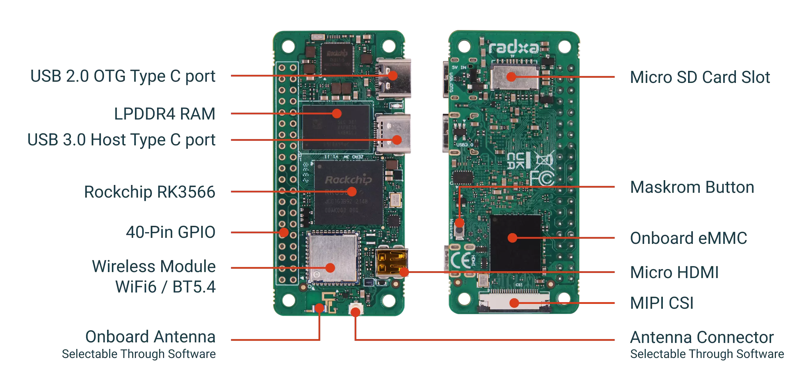

# 🖥️ Hardware Overview

The Radxa Zero 3W is a compact, high-performance single-board computer for makers, developers, and embedded projects.

---

## 📐 Board Layout

---

## 🔎 Explore Hardware Details

- [Specifications](hardware-specs.md): Full technical breakdown
- [Pinout Diagram](hardware-pinout.md): GPIO header and pin functions
- [Accessories](hardware-accessories.md): Recommended add-ons

---

## 🚀 Typical Use Cases

- IoT and edge computing
- Robotics and automation
- Home automation and smart hubs
- Media streaming and digital signage
- Prototyping and learning

---

> For in-depth specs, see [Hardware Specifications](hardware-specs.md) or visit the [official documentation](https://docs.radxa.com/en/zero/zero3).